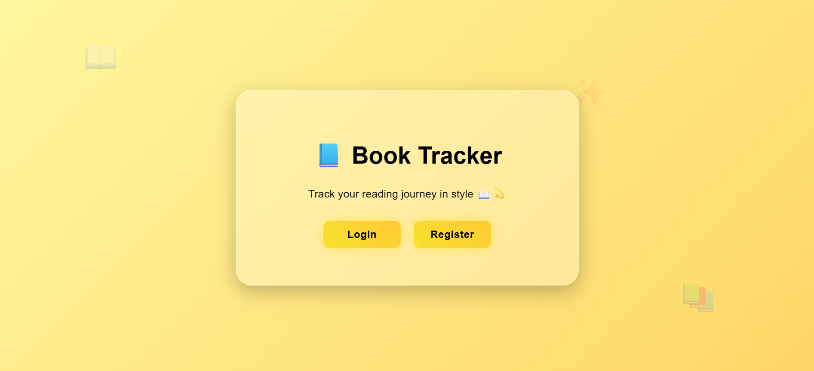
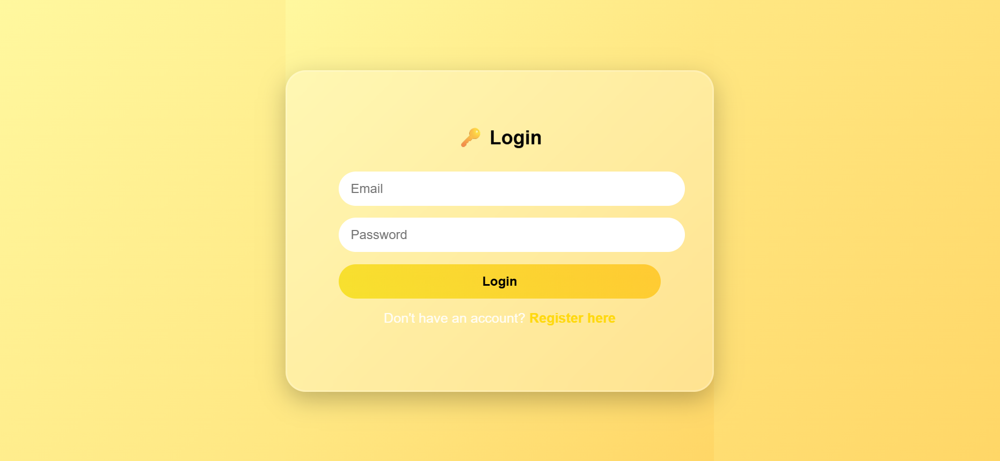
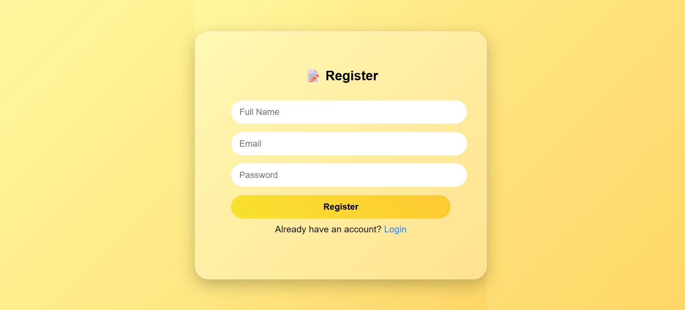
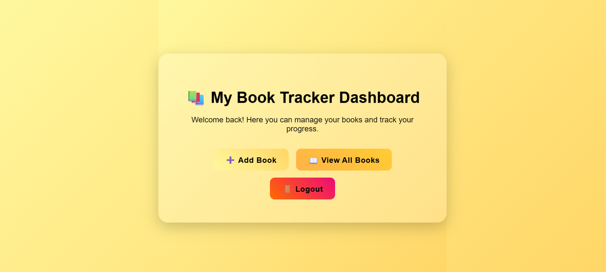
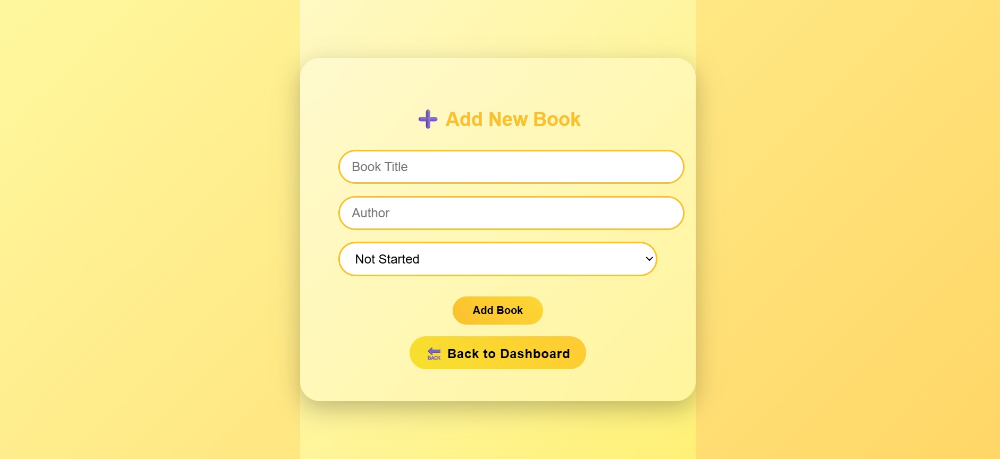

# Book Tracker Project

Book Tracker is a web application that helps you organize and manage the books you read or plan to read. Instead of keeping messy notebooks or spreadsheets, this app gives you a personal digital library where you can track your reading progress easily.

---

## Features
- Add, edit, and delete books  
- Categorize books by status  
- Search books  
- User registration & login  
- CRUD operations for books  
- Status-based filtering  
- Layered MVC structure: Controller → Service → Repository  

---

## Technologies Used
- Backend: Java, Spring Boot  
- Database: MySQL  
- Build Tool: Maven  
- Testing: Postman (for APIs)  
- Version Control: Git & GitHub  

---

## How to Use
1. Clone the repository:  
   ```bash
   git clone <your-repo-url>
## Frontend app images






